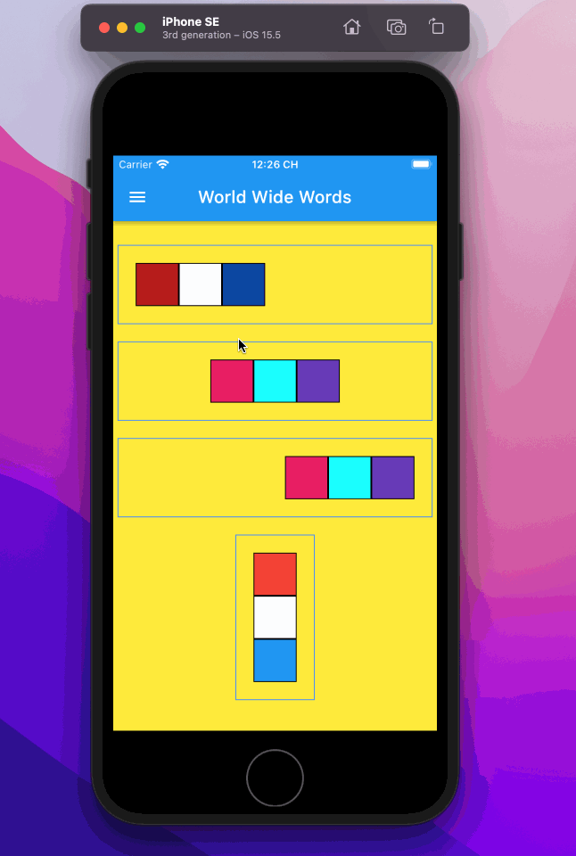

# 30 days of Flutter(1)

A few projects to understand Flutter.



- Layouts
- Instantiate class with Color class as input parameter.
- Drawer navigator
- Drawer items
- Navigator pop with context

```dart
class Box extends StatelessWidget {
  final Color colour;

  const Box({Key? key, required this.colour}) : super(key: key);

  @override
  Widget build(BuildContext context) {
    return Container(
      width: 50,
      height: 50,
      decoration: BoxDecoration(
        color: colour,
        border: Border.all(),
      ),
    );
  }
}
```

- Box Widget with a parameter color required.

```dart
class MyApp extends StatelessWidget {
  const MyApp({Key? key}) : super(key: key);

  @override
  Widget build(BuildContext context) => MaterialApp(
      debugShowCheckedModeBanner: false,
      color: Colors.red,
      title: 'Layouts',
      home: Container(
        color: Colors.yellow,
        child: SingleChildScrollView(
          padding: EdgeInsets.all(20),
          child: Center(
            child: Column(
              mainAxisSize: MainAxisSize.min,
              children: [
                Container(
                  margin: EdgeInsets.all(20.0),
                  padding: EdgeInsets.all(20.0),
                  decoration: BoxDecoration(
                      border: Border.all(color: Colors.blueAccent)),
                  child: Column(
                    children: [
                      Box(colour: Colors.red),
                      Box(colour: Colors.white),
                      Box(colour: Colors.blue),
                    ],
                  ),
                ),
              ],
            ),
          ),
        ),
      ));
}

```

